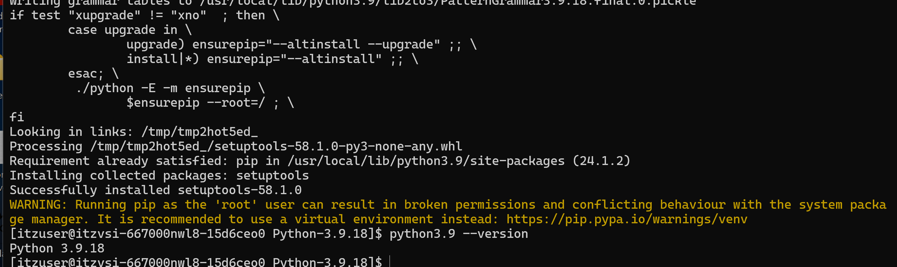

# How to install llama.cpp on RedHat Linux 9 offline.


We are going first create a Python enviroment where we are going to get the dependencies.


## Computer with Internet

First we need to following the next steps in the computer with internet.

### Step 1: Update Your System

First, ensure your system is up to date:

```bash
sudo yum update
```

### Step 2: Install Dependencies

Python requires several development libraries and tools to be installed. You can install these using `yum`:

```bash
sudo yum groupinstall "Development Tools"
sudo yum install openssl-devel bzip2-devel libffi-devel zlib-devel
sudo yum install wget
```

### Step 3: Download Python 3.9.18 Source Code

Next, download the source code for Python 3.9.18:

```bash
cd /usr/src
sudo wget https://www.python.org/ftp/python/3.9.18/Python-3.9.18.tgz
```

### Step 4: Extract the Tarball

Extract the downloaded tarball:

```bash
sudo tar xzf Python-3.9.18.tgz
cd Python-3.9.18
```

### Step 5: Configure the Script

Run the configure script to prepare the build environment:

```bash
sudo ./configure --enable-optimizations
```

The `--enable-optimizations` flag will optimize the Python binary using profile-guided optimization (PGO), which can take a while but results in a faster Python interpreter.

### Step 6: Build and Install Python

Compile and install Python. You can specify the number of CPU cores to use for the build process with the `-j` flag:

```bash
sudo make altinstall -j 4
```

The `altinstall` command prevents the overwriting of the default system Python.

### Step 7: Verify the Installation

Once the installation is complete, verify that Python 3.9.18 is installed correctly:

```bash
python3.9 --version
```

### Step 8: Set Up Virtual Environment (Optional but Recommended)

It's a good practice to use virtual environments to manage dependencies for different projects. You can set up a virtual environment using `venv`:

```bash
python3.9 -m venv myenv
```

Activate the virtual environment:

```bash
source myenv/bin/activate
```


1. **Updating Pip**: After setting up Python, you may want to update `pip` to the latest version:

    ```bash
    python -m pip install --upgrade pip
    ```


# Llama.cpp Packages Installation

Here is a detailed step-by-step tutorial on creating a `.whl` file for the `llama.cpp` project with all the binaries included. This tutorial assumes you are working in a Python virtual environment and have access to a computer with internet.

1. **Set up the environment and clone the repository:**

   ```bash
   # Create and activate the virtual environment
   python3.9 -m venv myenv
   source myenv/bin/activate

   # Clone the llama.cpp repository
   git clone https://github.com/ggerganov/llama.cpp
   cd llama.cpp
   ```

2. **Compile the binaries:**
   
   Follow the instructions in the `llama.cpp` repository to compile the binaries. For example:

   ```bash
   # Replace with actual build commands from the repository
   make
   ```

3. **Create a Python package directory structure:**

   ```python
   import os
   import shutil

   # Define package directory
   package_dir = 'llama_cpp_package'
   binaries_dir = os.path.join(package_dir, 'bin')
   os.makedirs(binaries_dir, exist_ok=True)

   # List of compiled binaries
   binaries = [
       'llama-convert-llama2c-to-ggml', 'llama-server', 'llama-simple', 'llama-speculative',
       'llama-tokenize', 'llama-export-lora', 'llama-train-text-from-scratch', 'llama-vdot',
       'llama-eval-callback', 'llama-gguf', 'llama-gguf-hash', 'llama-gguf-split',
       'llama-gritlm', 'llama-imatrix', 'llama-infill', 'llama-llava-cli', 'llama-lookahead',
       'llama-lookup', 'llama-lookup-create', 'llama-lookup-merge', 'llama-lookup-stats',
       'llama-parallel', 'llama-passkey', 'llama-perplexity', 'llama-q8dot', 'llama-quantize',
       'llama-quantize-stats', 'llama-retrieval', 'llama-save-load-state'
   ]

   # Move binaries to the binaries directory
   for binary in binaries:
       shutil.move(binary, os.path.join(binaries_dir, binary))

   # Create the setup.py file
   setup_code = """
   from setuptools import setup, find_packages
   import os

   def package_files(directory):
       paths = []
       for (path, directories, filenames) in os.walk(directory):
           for filename in filenames:
               paths.append(os.path.join(path, filename))
       return paths

   extra_files = package_files('bin')

   setup(
       name='llama_cpp_package',
       version='0.1',
       packages=find_packages(),
       include_package_data=True,
       package_data={
           '': extra_files,
       },
       data_files=[('', extra_files)],
       install_requires=[],
   )
   """

   # Write setup.py to the package directory
   os.makedirs(package_dir, exist_ok=True)
   with open(os.path.join(package_dir, 'setup.py'), 'w') as f:
       f.write(setup_code)
   ```

4. **Build the wheel file:**

   ```bash
   cd llama_cpp_package
   python setup.py bdist_wheel
   ```

5. **Locate the `.whl` file:**

   The built wheel file will be located in the `dist` directory. You can move this file to a shared location for offline installation.

   ```bash
   # Move the wheel file to a shared location (e.g., USB drive, shared folder)
   dist_files=$(ls dist/*.whl)
   for file in $dist_files; do
       cp $file /path/to/shared/location/
   done
   ```

6. **Install the wheel file on the offline computer:**

   Copy the `.whl` file to the offline computer and install it using `pip`.

   ```bash
   # Copy the wheel file to the offline computer

   # Activate the virtual environment on the offline computer
   python3.9 -m venv myenv
   source myenv/bin/activate

   # Install the wheel file
   pip install /path/to/copied/llama_cpp_package-0.1-py3-none-any.whl
   ```

By following these steps, you will be able to create a wheel file with all the binaries of the `llama.cpp` project and install it on an offline computer.


## Inference with llama.cpp

```python
import subprocess
import os
import requests

def download_model(repo_id, filename, target_path):
    """Downloads a model file from Hugging Face Hub."""
    base_url = f"https://huggingface.co/{repo_id}/resolve/main/{filename}"
    response = requests.get(base_url)
    response.raise_for_status()  # Ensure the request was successful
    with open(target_path, "wb") as f:
        f.write(response.content)
    print(f"Model downloaded to '{target_path}'")

def run_llama_cpp_inference(prompt, repo_id, filename, n_predict=256, top_k=40, temperature=0.7):
    """Runs inference using llama.cpp for a single prompt."""
    
    llama_cpp_executable = "./llama.cpp/llama-cli"
    if not os.path.exists(llama_cpp_executable):
        raise FileNotFoundError(f"llama.cpp executable not found: {llama_cpp_executable}")

    model_dir = "./models"
    os.makedirs(model_dir, exist_ok=True)
    model_path = os.path.join(model_dir, filename)
    
    if not os.path.exists(model_path):
        print(f"Downloading model '{filename}'...")
        download_model(repo_id, filename, model_path)
    else:
        print(f"Using locally cached model '{filename}'")

    try:
        result = subprocess.run([
            llama_cpp_executable,
            "-m", model_path,
            "-n", str(n_predict),
            "--top_k", str(top_k),
            "--temp", str(temperature),
            "-p", prompt
        ], capture_output=True, text=True, check=True)
        return result.stdout.strip()
    except subprocess.CalledProcessError as e:
        print(f"Error running llama.cpp for prompt '{prompt}':\n{e.stderr}")
        return "Error during inference"

# Example usage
prompt = "What is the capital of Italy?"
repo_id = "instructlab/granite-7b-lab-GGUF"
filename = "granite-7b-lab-Q4_K_M.gguf"

output = run_llama_cpp_inference(prompt, repo_id, filename)
print(f"Prompt: {prompt}\nResponse: {output}")


```


# llama python cpp


### Step 2: Install `pip-tools`

`pip-tools` is a package used to manage dependencies in a more controlled manner. Install it in your virtual environment:

```bash
pip install pip-tools
```

### Step 3: Create a Requirements File

Next, create a `requirements.txt` file with the dependencies for `llama.cpp`. For demonstration purposes, I'll assume that `llama.cpp` has specific dependencies. Create a file named `requirements.in` with the following content:

```txt
# requirements.in
llama.cpp
```

### Step 4: Compile Dependencies

Compile the `requirements.in` file into a `requirements.txt` file that includes all dependencies and their versions:

```bash
pip-compile requirements.in
```

This will generate a `requirements.txt` file with all the dependencies.

### Step 5: Download Dependencies

Use `pip` to download all the dependencies listed in the `requirements.txt` file into a folder:

```bash
mkdir llama_cpp_dependencies
pip download -r requirements.txt -d llama_cpp_dependencies
```

This command will download all the required packages into the `llama_cpp_dependencies` directory.

### Step 6: Create a Zip File

Zip the `llama_cpp_dependencies` folder:

```bash
zip -r llama_cpp_dependencies.zip llama_cpp_dependencies
```

Now you have a zip file (`llama_cpp_dependencies.zip`) containing all the dependencies required to install `llama.cpp`.

### Step 7: Transfer the Zip File to the Target System

Transfer the `llama_cpp_dependencies.zip` file to your RedHat Linux 9 system using a USB drive, SCP, or any other file transfer method.

### Step 8: Set Up Environment on the Target System

On your RedHat Linux 9 system, create a new virtual environment and activate it:

```bash
python3.9 -m venv myenv
source myenv/bin/activate
```

### Step 9: Install Dependencies Offline

Transfer the `llama_cpp_dependencies.zip` file to a suitable location on the RedHat Linux 9 system and unzip it:

```bash
unzip llama_cpp_dependencies.zip -d llama_cpp_dependencies
```

Navigate to the directory where the dependencies are located:

```bash
cd llama_cpp_dependencies
```

Install the dependencies from the local directory:

```bash
pip install --no-index --find-links=. -r ../requirements.txt
```

This command tells `pip` to install the packages from the local directory rather than searching online.

### Step 10: Install `llama-cpp-python`

Finally, install `llama-cpp-python`:

```bash
pip install llama-cpp-python
```

Since all the dependencies have already been installed, `pip` will not need to download anything from the internet.

### Summary

1. Set up and activate your virtual environment.
2. Install `pip-tools`.
3. Create a `requirements.in` file with the main package.
4. Compile the `requirements.in` file to `requirements.txt`.
5. Download all dependencies into a folder.
6. Zip the folder containing dependencies.
7. Transfer the zip file to the target system.
8. Set up a new virtual environment on the target system.
9. Unzip the dependencies and install them offline.
10. Install `llama-cpp-python`.


